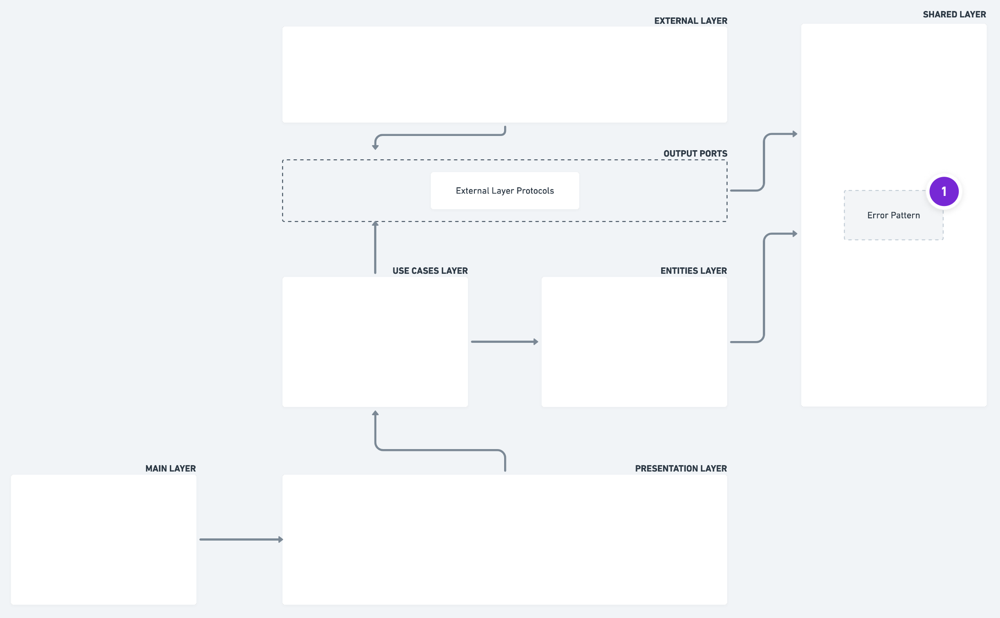

  <a href="https://pedromoraisf.medium.com">
    
    <h2 align="center">Server Stack</h2>
  </a>
  
Server sob Node.js com Typescript e aplicabilidade da Clean Architecture com conteitos de DDD.

## Mapa Arquitetural

## Gostaria de conversar sobre esses estudos?
Caso tenha interesse em devanear sobre esse tipo de estudo, seria um enorme prazer pra mim conversar contigo sobre. Me ache no:
- 🙋🏽‍♂️ [Linkedin](https://www.linkedin.com/in/pedromoraisf/)
- 📧 [Email](mailto:pedro.morais1997@gmail.com)
- Futuramente, pelo próprio Chat do Pedrão 😅